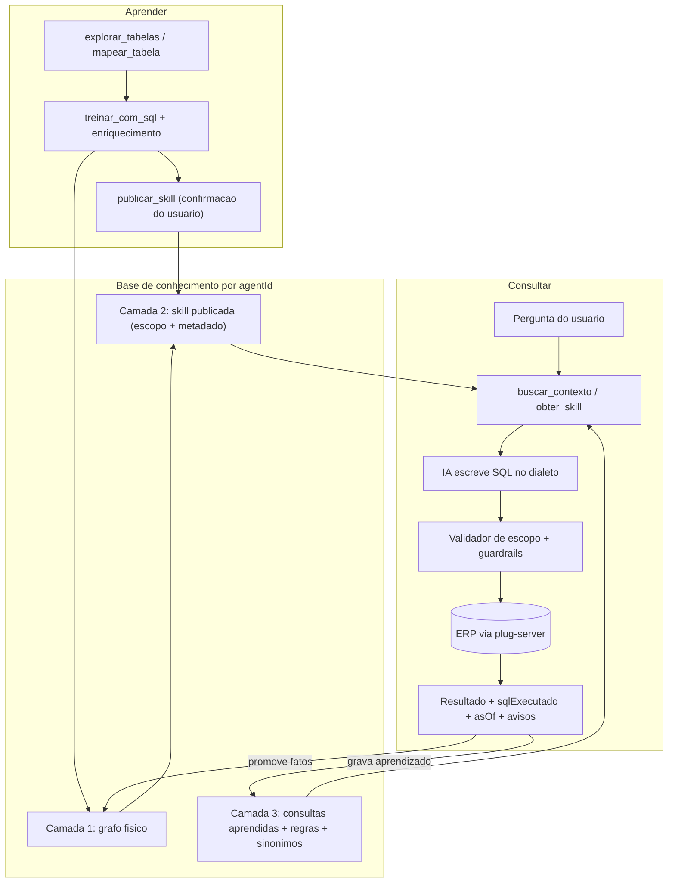

# Proposta de arquitetura — MCP Se7e para IA consultora

Documento autossuficiente para o criador do MCP. Descreve o destino (consultor de gestão com números reais), o diagnóstico do modelo atual, a arquitetura de três camadas e o plano de implementação. Afirmações abaixo estão ancoradas no código de `/root/plug_mcp` na data desta proposta.

## 1. Objetivo de negócio

O destino é um plugin distribuído ao usuário final, onde a IA age como **consultor de gestão**: lê números reais do ERP (vendas, financeiro, cadastros e demais recortes), consolida, compara períodos e entrega KPI, tabela e gráfico citáveis.

Isso exige três coisas:

1. **Base de conhecimento** sobre a estrutura do ERP daquele `agentId` (tabelas, colunas, relacionamentos, dicionários, regras).
2. **IA especialista em SQL** para Sybase SQL Anywhere, SQL Server (`mssql`) e Postgres, capaz de escrever `SUM`, `GROUP BY`, `ORDER BY` e recortes no dialeto certo.
3. **Escopo publicado** — o usuário confirma o recorte; a IA não inventa tabela, coluna nem JOIN.

O que já está certo e deve ser preservado: treino a partir de SELECT real do usuário, validação contra o banco de verdade, publicação com confirmação explícita, autorização 100% no `client_token` do plug-server, recusa de tabela inventada, cofre (e-mail, senha, `agentId`, `client_token`, dialeto).

## 2. Diagnóstico — estado alvo atingido e lacunas restantes

O núcleo das fases 0–6 **já está no código**. A skill publicada é o **escopo** (tabelas, colunas, JOINs), não uma query congelada. `consultar_dados` aceita o SELECT da IA dentro desse pacote; sem `sql`, executa a consulta exemplo (`sqlModelo`). Parser AST, validador de escopo, tools de aprendizado, auto-gravação em `consulta_aprendida`, flag `MCP_SKILL_TOOLS_ENABLED`, cache agregado e `herdar_catalogo` existem.

Uma tool MCP por skill (`skill_titulos-a-receber`) **não escala**: a lista de tools é contexto injetado em toda conversa. Catálogo continua sendo dado consultado sob demanda (`listar_skills` / `obter_skill` / `buscar_contexto`). Tools `skill_*` são opcionais (`MCP_SKILL_TOOLS_ENABLED`).

Lacunas reais deste ciclo (não reimplementar o núcleo):

- `treinar_com_sql` aceitava `enriquecer=completo` e ignorava (só `inferirPapelColuna`).
- Skills antigas com `escopo` JSON vazio derivavam allowlist só em memória.
- Suíte adversarial e guardrails (teto de `GROUP BY`, aviso de literal, bind no dry-run) incompletos.
- `obter_skill` não devolveva consultas aprendidas; `asOf` era sempre UTC.
- Esta proposta ainda descrevia o modelo antigo (recusa de SQL da IA).

### Correções de fato (o pedido original divergia do código)

- **Não existe "plano Fase 1 §8.3" neste repositório.** "Fase 1" em `docs/plug-server/communication.md` e `rest-integration.md` significa só **canal REST, Socket fora de escopo**. As tabelas `regra_negocio`, `sinonimo` e `fonte` existiram e foram **dropadas** em `drizzle/0008_cofre_grafo.sql`. Reintroduzir com escopo novo, não "resgatar o previsto".
- **O validador não recusa `TOP`.** Em `src/application/use-cases/shared/sql-modelo.ts` o `TOP` só aparece nos envelopes internos (`sqlAmostra`, `sqlValidacaoVazia`). Alias sem `AS` é aceito para coluna simples e recusado só em expressão (`SUM(x) apelido`). O atrito real é **coluna sem qualificador quando há JOIN** e **JOIN com função no `ON`**.
- **`consultar_dados` já aceita `params` e `options`** (`max_rows`, `page`, `page_size`, `timeout_ms`). O gap não é parametrização; é agregação livre guiada pelo conhecimento.
- **O dialeto é `mssql`**, não `sqlserver` (`src/domain/entities/dialeto.ts`). Fica travado por `agentId` em `grafo_dialeto`. Não havia tool de destrave (`atualizar_dialeto`).
- **Revalidar despublicava em silêncio.** `ValidarSkill` fazia `setStatus(id, "validada")` sem checar o status anterior.

## 3. Arquitetura alvo — três camadas

**Camada 1 — grafo físico (existe).** `explorar_tabelas`, `mapear_tabela`, `treinar_com_sql`, com origem `inferido` / `validado_execucao` / `confirmado_usuario`. Continua. Ganha papel, formato, perfil (min/max, nulos) na coluna e cardinalidade no relacionamento.

**Camada 2 — skill como pacote de conhecimento (redefinida).** O recorte publicado deixa de ser só o texto do SELECT e passa a carregar:

- tabelas e aliases
- ligações: predicado do JOIN, tipo (`INNER`/`LEFT`) e cardinalidade aferida
- grão: o que é uma linha
- colunas com papel (`chave` | `dimensao` | `medida` | `codigo` | `data`), tipo, formato, `nullable`, `min`/`max`, dicionário
- `sqlModelo` como **consulta exemplo** validada, não a única coisa executável
- `escopo` jsonb: allowlist canônica de tabelas, colunas e relacionamentos

Manter a palavra "skill" na interface do usuário; o que muda é o que ela significa por dentro. Publicar continua exigindo `confirmadoPeloUsuario: true`.

**Camada 3 — aprendizado contínuo (nova).** Consultas que funcionaram, regras e métricas documentadas (`anotacao_grafo.tipo` = `regra` | `metrica`), sinônimos, lacunas. A IA reusa o que já provou funcionar e grava o que o usuário ensinou.

## 4. Pacote da skill (`obter_skill`)

A tool devolve o pacote completo, filtrado pelo que a policy do `client_token` realmente lê:

- skill (id, slug, nome, descrição, status, versão, consulta exemplo, params)
- `escopo`: tabelas, colunas por tabela, relacionamentos permitidos, grão
- colunas enriquecidas (papel, tipo, formato, dicionário, perfil)
- relacionamentos com cardinalidade
- anotações `regra` e `metrica`
- consultas aprendidas (exemplos reutilizáveis)
- `guiaDialeto`: paginação, funções de data, concatenação, cast daquele dialeto
- `escopoPadrao` do acesso (empresa/filial) e `timezone`

## 5. Interface de consulta — SQL da IA no escopo

A IA **escreve SQL**. O servidor valida contra o escopo e executa via plug-server.

`consultar_dados(acessoId, skillIds[], sql?, params?, options?)`

- **Sem `sql`:** executa a consulta exemplo da skill (`sqlModelo`). Compatibilidade preservada.
- **Com `sql`:** valida contra a **união** dos escopos das skills publicadas em `skillIds`. Aceitar mais de uma skill permite cruzar financeiro e vendas **sem inventar relacionamento**.
- `firebird`: SQL livre recusado (`DIALECT_UNSUPPORTED`) até haver parser adequado; consulta exemplo continua.

Por que validar o SQL, e não um compilador de especificação:

- A IA já é boa em SQL; o gargalo era o servidor recusar o SQL, não a IA não saber `GROUP BY`.
- Coluna inventada continua impossível: o validador busca o nome no catálogo do escopo.
- Dialeto sai do problema da IA via **guia de dialeto** no pacote, não via compilador.
- Grão e cardinalidade no pacote avisam contra dupla contagem; o JOIN inventado é recusado.

### Validador de escopo

1. Um único SELECT, sem mutação, sem `SELECT *` (incluindo CTE e subquery) — via AST.
2. Toda tabela no escopo, senão `TABELA_FORA_DO_ESCOPO` com nomes próximos.
3. Toda coluna no catálogo da sua tabela, senão `COLUNA_FORA_DO_ESCOPO` listando as disponíveis.
4. Todo JOIN casa com relacionamento conhecido, senão `JOIN_DESCONHECIDO`. `confirmar_relacionamento` ensina um novo.
5. Subquery e CTE herdam as mesmas regras.

### Guardrails de custo

- Sem `WHERE` e sem agregação → `CONSULTA_SEM_RECORTE`.
- Paginação sem `ORDER BY` → erro (página instável).
- Recusa de produto cartesiano; teto de grupos no `GROUP BY`; `max_rows` e `timeout` já existentes.
- Valor do usuário final em `params` nomeados. Literal de texto inline gera aviso, não erro.

### Dry-run

`validar_consulta(acessoId, skillIds[], sql)` valida escopo e roda o envelope `WHERE 1=0` no ERP sem ler dado.

### Resposta

- `colunas[]` / `rows` / `rowCount`
- `sqlExecutado` e `paramsUsados` — a IA cita o número
- `asOf` (momento da leitura, fuso do ERP)
- `recorte`: JOINs `INNER` que restringem o universo
- `escopoAplicado`: empresa/filial usadas, ou aviso de consolidado
- `avisos[]`: regras de negócio da skill
- `truncated` com semântica correta: pediu `maxRows+1` e cortou; uma linha de `SUM` nunca é universo cortado

## 6. Superfície de tools

Descoberta: `listar_skills`, `obter_skill`, `buscar_contexto`.

Consulta: `consultar_dados` (exemplo ou SQL no escopo), `validar_consulta`.

Treino de dataset: `treinar_com_sql` + enriquecimento, `confirmar_coluna`, `anotar_grafo`, `resolver_conflito`, `expandir_escopo`, `confirmar_relacionamento`.

Aprendizado: `salvar_consulta`, `registrar_aprendizado`, `listar_auditoria`.

Cofre: inalterado + `atualizar_dialeto`.

**Descontinuar as tools geradas por skill** (`skill_titulos-a-receber`) atrás de flag `MCP_SKILL_TOOLS_ENABLED`. São a fonte do inchaço de contexto.

## 7. Enriquecimento no treino

No `treinar_com_sql` (e sempre que o SQL da skill mudar), usando **somente** tabelas e colunas do SELECT enviado — sem `SELECT *`, sem tabela extra:

- ligações: predicado, tipo e cardinalidade (`COUNT` vs `COUNT DISTINCT` nas chaves já presentes)
- tipos efetivos do driver e formato observado
- `min`/`max` em datas e números
- taxa de nulos
- `DISTINCT` limitado em coluna de baixa cardinalidade, gerando **candidato** a dicionário; rótulo de negócio só com `confirmar_coluna`
- papel de cada coluna e grão da linha

Parâmetro `enriquecer: "basico" | "completo"` (default `basico`). Completo é opt-in e tem teto de consultas — perfilamento bate no ERP do cliente.

Precedência mantida: `validado_execucao` > `confirmado_usuario` > `inferido`. Empate vai para `resolver_conflito`.

Backfill: o escopo das skills já publicadas é derivado do parse do `sql_modelo` na primeira leitura (`obter_skill` / `consultar_dados`) e no script `npm run db:backfill-escopo`, sem o usuário reescrever SQL. Postgres não parseia o SELECT na migration.

## 8. Instruções da IA

Reescritas em `src/infrastructure/mcp/server-instructions.ts` (é o que vai em `initialize.instructions`; não há `INSTRUCTIONS.md` na raiz):

- Leia o pacote da skill e o guia de dialeto antes de escrever SQL.
- Agregue no banco (`SUM`/`COUNT`/`GROUP BY`); nunca puxe a listagem e some no lado da IA.
- Use `WHERE` sempre que delimitar o pedido.
- Nunca invente tabela, coluna ou JOIN.
- Várias consultas por pergunta são esperadas.
- `validar_consulta` antes de executar quando não tiver certeza.
- Cite skill, `sqlExecutado`, `asOf` e o recorte do `INNER`.
- Se `truncated`, refine ou pagine em vez de somar grupos.
- Grave o que aprender (`salvar_consulta`, `registrar_aprendizado`).

## 9. Correção do número

**Escopo de empresa e filial.** Skills típicas têm `CodEmpresa` e `CodFilial`; "qual o total em aberto" somava todas as empresas em silêncio. Escopo padrão no acesso, aplicado (aviso na Fase 3–5; filtro obrigatório na Fase 6). Sem default, a resposta declara consolidado.

**Regras de negócio.** Dicionário diz que `F` é Refatorado; não diz que título refatorado tem substituto. Regra por skill ou métrica, escrita pelo usuário no treino (`anotar_grafo` com `tipo=regra`), exposta no pacote e citada em `avisos`.

**Data de referência e fuso.** "Vencidos" depende de qual "hoje". `timezone` no acesso; `asOf` na resposta. Cálculo de aging no SQL, não no cliente da IA.

**Consistência do dado (opcional no treino).** Checagem do tipo `SaldoReceber = Valor - ValorRecebido`; se violar, avisar.

## 10. Descoberta e auto-correção

**Sinônimos.** "Duplicatas", "carteira", "inadimplência" caem no mesmo dataset. Tabela `sinonimo`; `buscar_contexto` expande a query.

**Erro que ensina.** Coluna inexistente lista alternativas próximas (`CodVendedor` não existe; disponíveis: `CodCliente`, …).

**Permissão refletida no catálogo.** `obter_skill` recorta o que o `client_token` realmente lê.

## 11. Ciclo de vida e confiança

**Não despublicar em silêncio.** Revalidação preserva `publicada` quando o SQL não mudou.

**Versionamento.** Skill já tem `versao`. Consulta aprendida registra SQL e data.

**Auditoria.** `audit_log` já existe; estender às tools novas e expor `listar_auditoria`.

**Telemetria de lacunas.** `lacuna_consulta` registra pergunta sem dataset capaz — fila de treino por demanda real.

## 12. Custo, escala e catálogo template

Guardrails da seção 5. Tools `skill_*` atrás de flag. Catálogo template multi-cliente (datasets e consultas exemplo por dialeto) que um `agentId` novo herda. Cache de resultado agregado (Redis já no projeto).

## 13. Parser AST e dialetos

Validar SQL arbitrário contra allowlist é impossível com o parser regex de `sql-modelo.ts`. O servidor usa `node-sql-parser`:

| Dialeto MCP | Parser        | SQL livre                       |
| ----------- | ------------- | ------------------------------- |
| `mssql`     | `transactsql` | sim                             |
| `sybase`    | `transactsql` | sim (SQL Anywhere, views T-SQL) |
| `postgres`  | `postgresql`  | sim                             |
| `firebird`  | —             | não; só consulta exemplo        |

Limitação declarada, não bug silencioso.

## 14. Gaps do teste real (histórico)

- Consulta agregada impossível: só o `sqlModelo` congelado.
- Dialeto travado no primeiro treino; base do `agentId` virou SQL Server e o acesso seguia `sybase`.
- Revalidar as duas skills as tirou de `publicada` para `validada`.
- Tools `skill_*` só com `acessoId` — sem recorte, sem agregação.

## 15. Fase 2 de produto (depois desta entrega)

- Cruzar dois datasets no mesmo SQL com relacionamento validado (já parcialmente coberto por `skillIds[]`).
- Funções de janela (`ROW_NUMBER`, `SUM() OVER`) no SQL da IA — o AST precisa reconhecê-las e o validador de colunas precisa enxergá-las.
- Comparação de período como consulta aprendida reutilizável.
- Cache de resultado agregado por hash do SQL+params.

## 16. Migração e critérios de aceite

Skills atuais (`titulos-a-receber`, `titulos-a-pagar`) já têm SELECT validado. O `escopo` vazio é preenchido na primeira leitura (e no script de backfill) a partir do `sql_modelo`, sem o usuário reescrever SQL. Em cima delas, primeiras anotações `metrica`: `saldo_em_aberto`, `saldo_a_pagar_em_aberto`, `vencidos_30`.

Critérios:

1. `consultar_dados` sem `sql` continua executando o `sqlModelo`.
2. `consultar_dados` com `sql` aceito só se tabelas/colunas/JOINs estão no escopo publicado.
3. Tabela/coluna/JOIN fora do escopo devolve código dedicado + alternativas próximas.
4. `SELECT *`, mutação, segundo comando e `SELECT *` em subquery são recusados.
5. Sem `WHERE` e sem agregação → `CONSULTA_SEM_RECORTE`.
6. Paginação sem `ORDER BY` recusada.
7. `truncated` só quando veio linha a mais que o teto.
8. Resposta traz `sqlExecutado`, `paramsUsados`, `asOf`, `recorte`.
9. Revalidar skill publicada **não** a despublica.
10. `atualizar_dialeto` com confirmação regrava o lock e rebaixa skills a rascunho.
11. `obter_skill` devolve o pacote + guia de dialeto, recortado pela policy.
12. Firebird recusa SQL livre com código explícito.
13. Execução bem-sucedida promove fatos a `validado_execucao`.
14. `buscar_contexto` devolve consultas aprendidas e respeita sinônimos.
15. Tools `skill_*` desligáveis por flag.

## Riscos

- O validador de escopo passa a ser a superfície crítica de segurança. A suíte adversarial não é opcional.
- Introspecção `sybase` usa `sysobjects`/`syscolumns` (views T-SQL no SQL Anywhere). Validar `c.status & 8` e `t.usertype` contra base real antes de confiar no perfilamento.
- O hub precisa preservar o SQL agregado (`execution_mode: preserve` em `docs/plug-server/rest-integration.md`).
